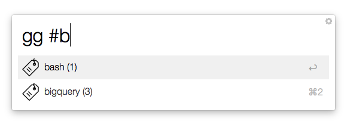
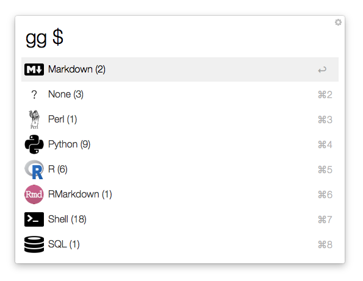
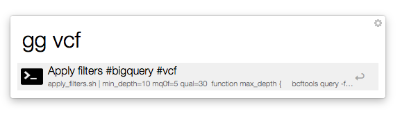
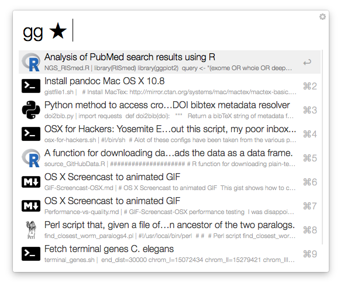

# gist-alfred

### [Download](https://github.com/danielecook/gist-alfred/releases/latest)

An alfred workflow for accessing gists as snippets. Features:

* Full Search
* Adds tagging and allows filtering by tag
* Allows filtering and search by programming language.
* Filter by starred, public, and private gists. 
* Stores gists locally to speed up access. Reload as needed.

__Setup__

Type gg_set and enter a username and [personal access token](https://github.com/blog/1509-personal-api-tokens) from github.

__Implements tags using #__

__Gists can be filtered by Language__

__Search Gists__

__Filter by starred__

