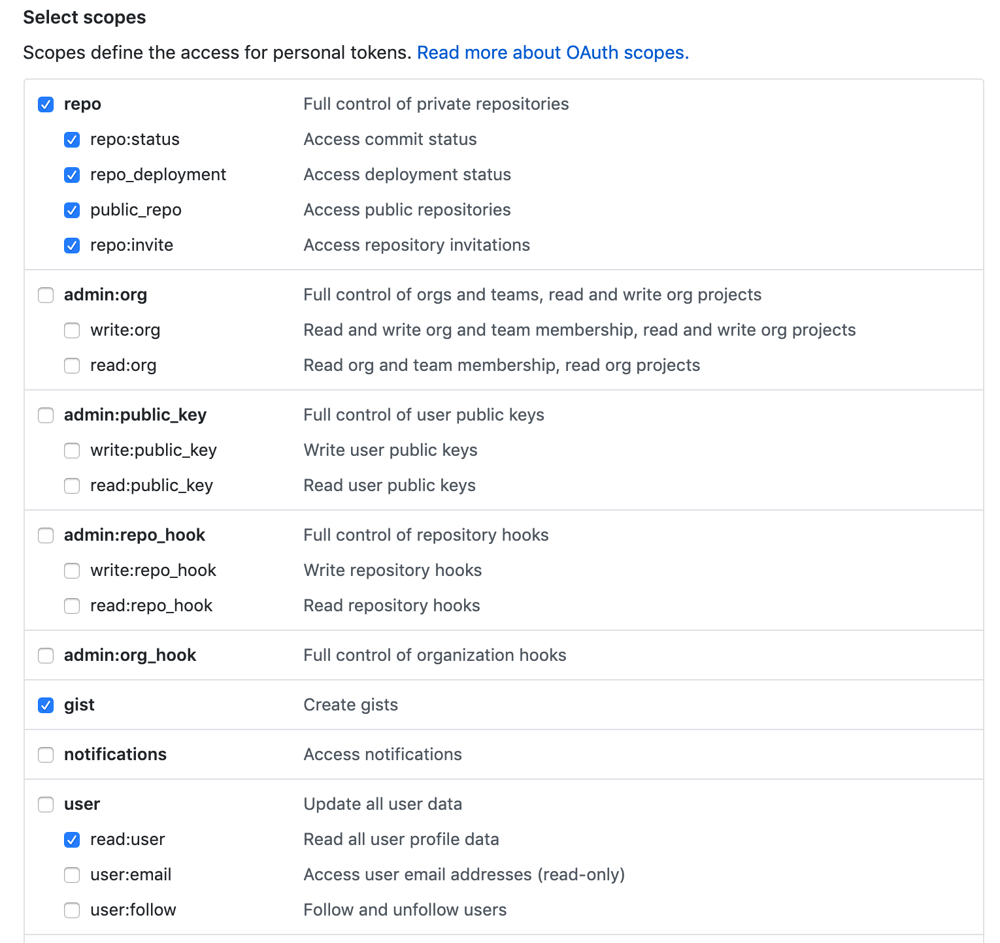

# gist-alfred

### [Download](https://github.com/danielecook/gist-alfred/releases/latest)

An Alfred workflow for accessing gists as snippets. Features:

* Full-text search of gists.
* Creation of gists from clipboard contents.
* Creation of gists from text files.
* Support for tagging and filtering by tag.
* Filtering and searching of gists by programming language.
* Filtering by starred, public, and private gists.
* Local cache of gists to speed up access (updates automatically daily or on request)

__Setup__

Type `gg_set` and enter a username and [personal access token](https://github.com/blog/1509-personal-api-tokens) from GitHub.

Set the permissions to the following - __Important__ you must set these permissions for all functionality to work:

__Tagging using using #__

__Search text of gists__

__Filter by starred__

__Filter by language__

